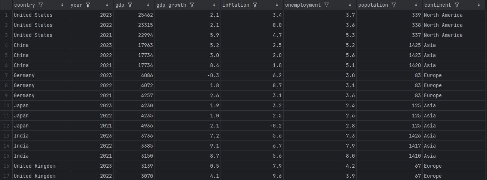
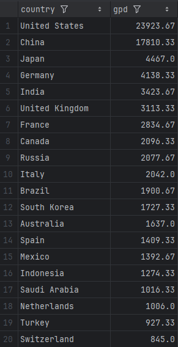
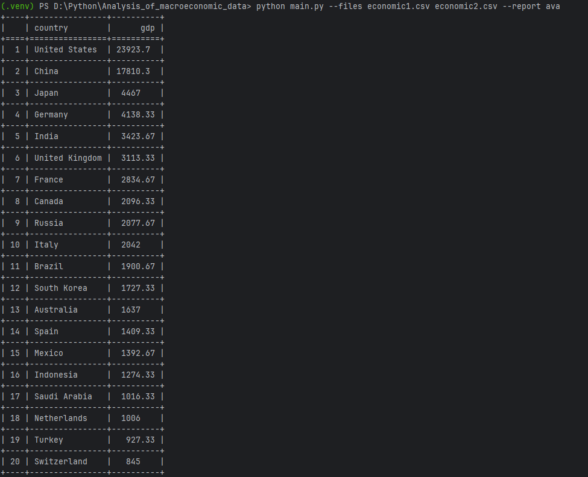
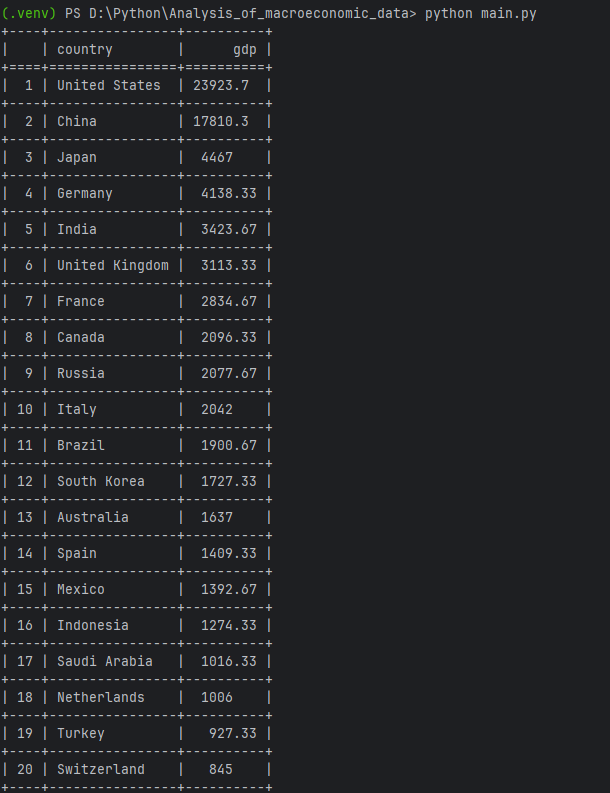
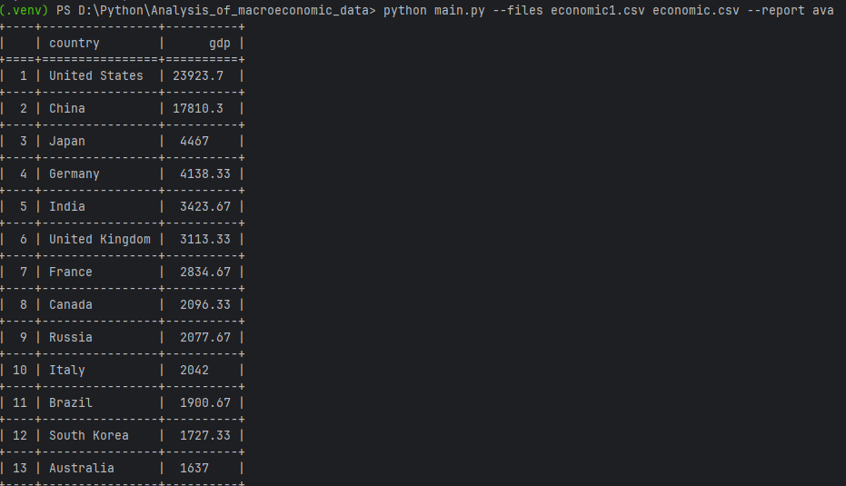
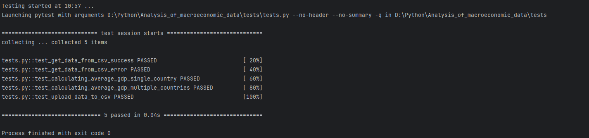

---

# Анализ макроэкономических данных

Скрипт читает файлы с экономическими данными по странам и формирует отчёты.
Пример входного файла показан на рисунке:



Программа формирует **единственный отчёт**, в котором отображается средний ВВП по каждой стране (среднее арифметическое по колонке `gdp`), а страны сортируются по убыванию ВВП.
Пример итогового отчёта можно увидеть здесь:



---

Название входных файлов (может быть несколько) и имя выходного отчёта передаются через параметры командной строки `--files` и `--report`:



Отчёт формируется **по всем указанным файлам сразу**, а не по каждому по отдельности.
Чтобы скрипт работал, достаточно положить файлы в папку `/data` и указать их при запуске программы.

Пример вызова:

```bash
python main.py [--files <файлы через пробел>] [--report <имя отчёта>]
```

Если параметры не указаны, программа использует значения по умолчанию и автоматически берёт все файлы из папки `/data`:



Если пользователь введёт несуществующее название файла, такой файл **будет проигнорирован** при формировании отчёта:



---

Вывод отчёта в консоль выполняется с помощью модуля `tabulate`.
Файл-отчет будет находиться в корневой папке скрипта.
Скрипт покрыт тестами, которые находятся в папке `/tests`.
Пример результата выполнения тестов:



---
